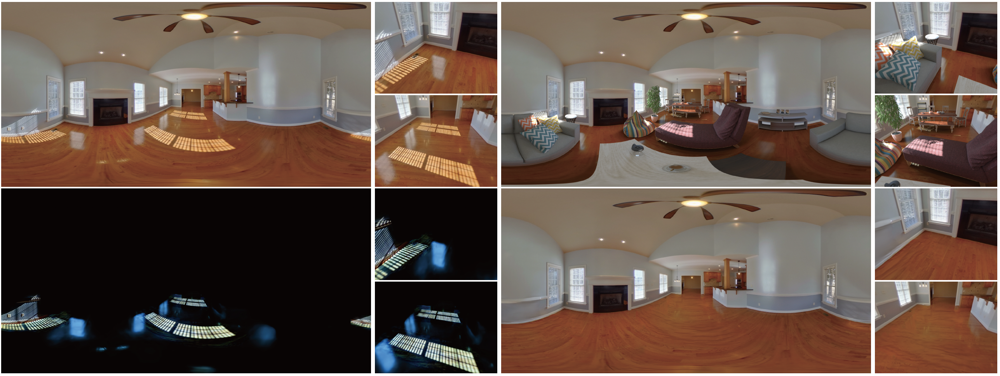

# Semantically Supervised Appearance Decomposition for Virtual Staging from a Single Panorama

[Tiancheng Zhi](https://tiancheng-zhi.github.io/), [Bowei Chen](https://armastuschen.github.io/), [Ivaylo Boyadzhiev](https://www.cs.cornell.edu/~iboy/), [Sing Bing Kang](http://www.singbingkang.com/), [Martial Hebert](http://www.cs.cmu.edu/~hebert/), [Srinivasa G. Narasimhan](http://www.cs.cmu.edu/~srinivas/)

ACM Transactions on Graphics (SIGGRAPH 2022)

[[Project]()] [[Paper]()]

<p align='center'>

</p>

## Data Preparation
1. Download ZInD dataset according to instructions on [`https://github.com/zillow/zind`](https://github.com/zillow/zind).
2. Put data in `data/zind/raw/`. The folder structure is `data/zind/raw/<scene_id>`, where `<scene_id>` ranges from 0000 to 1574.
3. Under [`prepare`](prepare) folder, run:
```
python resize_panos.py --split ${SPLIT}
```
`${SPLIT}` is `train`, `val`, or `test`.

## Semantic Segmentation
1. Download corresponding 3rd party models from [`https://gitihub.com/CSAILVision/semantic-segmentation-pytorch`](https://github.com/CSAILVision/semantic-segmentation-pytorch) and put them in `models/mit_semseg`:
```
mit_semseg/ade20k-hrnetv2-c1/encoder_epoch_30.pth
mit_semseg/ade20k-hrnetv2-c1/decoder_epoch_30.pth
mit_semseg/hrnetv2_w48-imagenet.pth
```
2. Download pretrained models (light.pth, tripod.pth, semantic.pth) from [Google Drive](https://drive.google.com/drive/folders/1RzSMW28at7O8PVoD4OGPA1aEvFEIOfql?usp=sharing) and put them in `models`.
3. Obtain HDR and tripod: Under [`semantic`](semantic) folder, run:
```
python infer_light.py --test-lists ../lists/zind_panos_${SPLIT}.txt --log ../data/zind/scenes/light/${SPLIT}
python infer_tripod.py --test-lists ../lists/zind_panos_${SPLIT}.txt --log ../data/zind/scenes/tripod/${SPLIT}
```
4. Obtain semantic map: Under [`semantic`](semantic) folder, run:
```
python infer_sem_lr.py --test-lists ../lists/zind_panos_${SPLIT}.txt --log ../data/zind/scenes/semantic/${SPLIT}
```

## Lighting Effects Detection
1. Due to license issues, we cannot redistribute SN-GAN code, please follow the instructions below:
    1. Put `src/*` from [`https://github.com/godisboy/SN-GAN`](https://github.com/godisboy/SN-GAN) in `networks/sngan/`.
    2. Replace the line below in `networks/sngan/snlayers/snconv2d.py`

        `super(SNConv2d, self).__init__(in_channels, out_channels, kernel_size, stride, padding, dilation, False, _pair(0), groups, bias)`

        by

        `super(SNConv2d, self).__init__(in_channels, out_channels, kernel_size, stride, padding, dilation, False, _pair(0), groups, bias, padding_mode='zeros')`

2. Coarse sunlight generation: Under [`sunlight`](sunlight) folder, run:
```
python coarse_sunlight.py --list ../lists/zind_panos_${SPLIT}.txt --out ../data/zind/scenes/csunl/${SPLIT}
```
3. Train effects detection network: Under [`decomp`](decomp) folder, run:
```
python train_effects.py
```
4. Infer effects detection network: Under [`decomp`](decomp) folder, run:
```
python infer_effects.py --test-lists ../lists/zind_panos_${SPLIT}.txt --log ../data/zind/scenes/eff/${SPLIT} --ckpt ${MODEL_PATH}
```

## Coming Soon
- Lighting effects removal
- Applications

## Disclaimer
The result produced by this code might be slightly different from the result in the paper, because in this code:
- Tripods are not inpainted.
- Layout estimation is not used for improving semantic segmentation.
